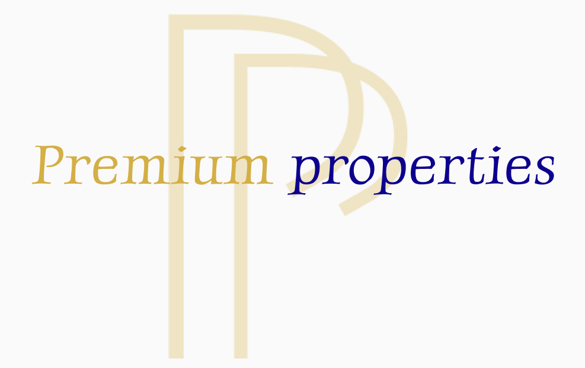

# Premium Properties



---

**Author**: Jarryd Carelse  
**Contact**: +27 71 480 8011 | 221267@virtualwindow.co.za  
**Project Type**: University Assignment  
**Course**: Advanced PHP Concepts and Authentication  
**Year**: Second-Year Development Student

---

## Project Overview

**Premium Properties** is a sophisticated web application developed to simulate the functionalities of a real estate agency's online platform. Created as part of a university assignment, this project demonstrates advanced skills in PHP, SQL, and full-stack web development. The application supports property management, user interactions, and administrative content moderation through a secure, intuitive interface.

This project showcases key competencies such as user authentication, CRUD (Create, Read, Update, Delete) operations, and the implementation of role-based access control. The application provides a strong foundation for developing complex, real-world web applications with scalable architecture.

---

## Demo Video

Experience the application through a live demo: [Watch Demo Video](https://drive.google.com/file/d/1GFe_7HjuLxxkLHUXoBI92leya33ob1Dg/view?usp=sharing)

---

## Features

### User Functionality

- **Registration & Authentication**:
  - **User Registration**: New users can create accounts using a secure registration form, ensuring their data is stored safely in the database.
  - **User Login**: Existing users log in to access personalized features.

- **Property Management**:
  - **Add Property Listings**: Users can submit new property listings, including descriptions, images, and pricing. These properties are manageable via the user's profile.
  - **Liked Properties**: Users can save properties of interest on a "Liked" page for easy access and review.

- **Search & Filter**:
  - **Property Search**: Users can search for properties using keywords.
  - **Advanced Filtering**: Users refine search results with filters like location, price range, and property type.

- **User Interaction**:
  - **View Property Details**: Users access detailed information for each property, including images, descriptions, and pricing.
  - **Commenting & Liking**: Users engage with listings by commenting and liking, fostering a community atmosphere.
  - **Activity Tracking**: All user activities (e.g., comments and likes) are tracked and can be viewed in the user profile.

### Admin Functionality

- **Admin Dashboard**:
  - **Centralized Management**: Admins access a dedicated dashboard with an overview of content, user activities, and listings.
  - **Role-Based Access Control**: Admins manage users, property listings, and comments with elevated privileges.

- **Property Approval**:
  - **Moderation of Listings**: Admins review, approve, or deny property listings submitted by users to maintain content quality.

- **User & Comment Management**:
  - **User Management**: Admins can suspend or delete accounts as necessary.
  - **Comment Moderation**: Admins can remove comments that violate platform guidelines.

---

## Technical Details

### Technologies Used

- **Frontend Development**:
  - **HTML/CSS**: Structured and styled pages for a responsive, visually appealing interface.
  - **JavaScript**: Added interactivity and client-side validation for an enhanced user experience.
  - **Figma**: Used for UI/UX design, including wireframes, mockups, and prototypes to guide development.

- **Backend Development**:
  - **PHP**: Core language for server-side logic, managing user sessions, form submissions, and data processing.
  - **SQL/MySQL**: Database management, facilitating storage, retrieval, and manipulation of user data, property listings, and comments.

- **Development Environment**:
  - **XAMPP**: Local development environment, providing Apache, MySQL, and PHP servers for testing and running the application.
  - **VS Code**: Primary IDE used for writing, debugging, and maintaining the codebase.

### Database Structure

The application employs a relational database designed to efficiently manage user information, property listings, and interactions. Key tables include:

- **Users Table**:
  - **Schema**: Stores user credentials, roles (e.g., admin, regular user), and personal details.
  - **Security**: Passwords are securely hashed to protect user data.

- **Properties Table**:
  - **Schema**: Contains all property details, including unique property IDs, titles, descriptions, prices, locations, and the user IDs of property owners.

- **Comments Table**:
  - **Schema**: Manages user-generated comments on properties, linking each comment to a specific user and property.

- **Likes Table**:
  - **Schema**: Tracks user interactions with properties, such as likes, allowing for personalized recommendations.

---

## Installation & Setup

To set up and run the Premium Properties web application on your local machine, follow these steps:

### 1. Clone the Repository
Clone the project repository from GitHub to your local machine:
```bash
git clone https://github.com/yourusername/premium-properties.git
